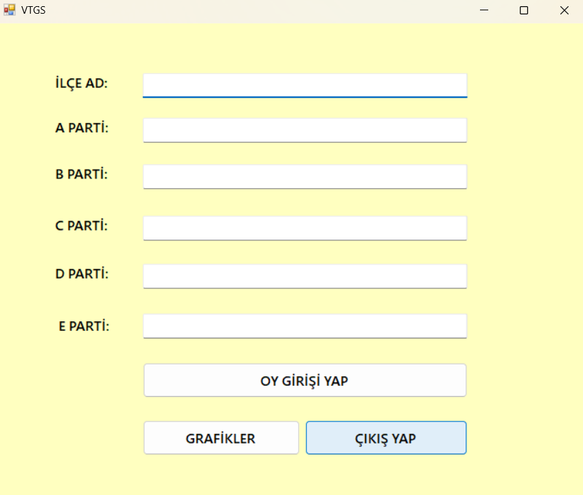

# VERİ TABANLI PARTİ SEÇİM GRAFİK SİSTEMİ
Bu proje, C# ile Windows Forms kullanarak geliştirilen bir oy sayım ve görselleştirme uygulamasıdır. Kullanıcılar, ilçeler için parti bazlı oy girişleri yapabilir ve bu verileri grafiklerle analiz edebilir.

 <h2>📌 Proje Özellikleri</h2>
<ul>
  <li>İlçeler için parti bazlı oy girişini sağlar.</li>
  <li>Kullanıcılar, oyları girebilir ve kaydedebilir.</li>
  <li>Verileri çubuk grafik (Bar Chart) ile görselleştirir.</li>
  <li>Girilen verileri detaylı olarak listeleme özelliği.</li>
  <li>Kullanıcı dostu, basit ve şık bir arayüz.</li>
</ul>

 <h2>🛠️ Kullanılan Teknolojiler</h2>
<ul>
  <li>C# (Windows Forms)</li>
  <li>.NET Framework</li>
  <li>MSSQL (Opsiyonel veri kaydı için)</li>
</ul>

 <h2>📸 Ekran Görüntüleri</h2>

 Ana Sayfa - Oy Girişi
  
 
 

